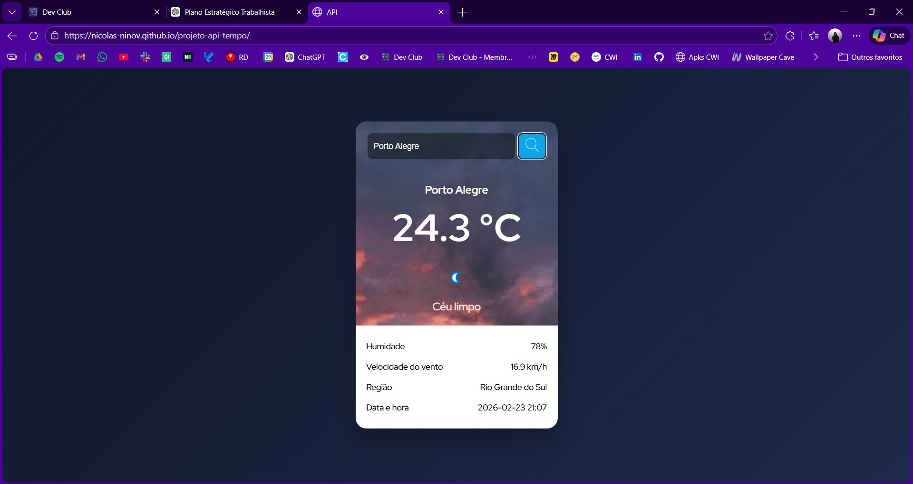

# 🌤️ Weather App - Consulta de Clima em Tempo Real

## 🎯 Objetivo do Projeto

O Weather App é uma aplicação web desenvolvida em JavaScript puro com foco no domínio dos fundamentos da linguagem e no estudo de comunicação com APIs externas.

O projeto foi criado como parte do processo de evolução técnica em desenvolvimento web, priorizando:

- Organização do código
- Clareza arquitetural
- Tratamento de erros
- Controle de concorrência em requisições assíncronas

Nenhum framework foi utilizado neste estágio, pois o objetivo principal foi fortalecer a compreensão dos conceitos fundamentais da linguagem JavaScript antes da adoção de bibliotecas como React.

---

## 📸 Preview

---

## 🚀 Funcionalidades

- Busca de informações climáticas por cidade
- Exibição de temperatura atual
- Condição do clima
- Umidade e velocidade do vento
- Região e horário local
- Interface responsiva para dispositivos móveis
- Controle de múltiplas requisições simultâneas

---

## 🏗️ Arquitetura do Projeto

O projeto foi organizado de forma modular para melhorar a manutenção e legibilidade do código.

### Estrutura simplificada:

A aplicação foi organizada seguindo um modelo simples de separação de responsabilidades, dividindo o código entre:

- Service Layer: responsável pela comunicação com a API externa
- UI Layer: responsável pela atualização da interface
- Main Script: responsável por coordenar eventos e fluxos da aplicação

Essa abordagem facilita a manutenção e a evolução futura do projeto.

---

## 🛠️ Tecnologias Utilizadas

- HTML5
- CSS3
- JavaScript (ES6+)
- Fetch API
- Async/Await
- Modularização de código

---

## 📚 Aprendizados Técnicos

Neste projeto pratiquei e refinei:

- Consumo de APIs REST
- Fluxo assíncrono com Promises
- Tratamento de erros de rede e lógica
- Separação de responsabilidades
- Organização modular do código
- Responsividade com CSS
- Controle de estado para evitar requisições redundantes

---

## 🌐 Acesso à Aplicação

Você pode executar o projeto localmente abrindo o arquivo:

index.html

Ou acessar a versão online:

🔗 https://nicolas-ninov.github.io/projeto-api-tempo/

---

## ⚠️ Observação Técnica

Este projeto utiliza a WeatherAPI.

Caso a chave de API expire, será necessário gerar uma nova chave em:

https://www.weatherapi.com/

---

## 📌 Próximos Passos de Evolução

- Estudos de React
- Melhoria do controle de estado da aplicação
- Implementação de debounce para busca
- Refinamento da UX